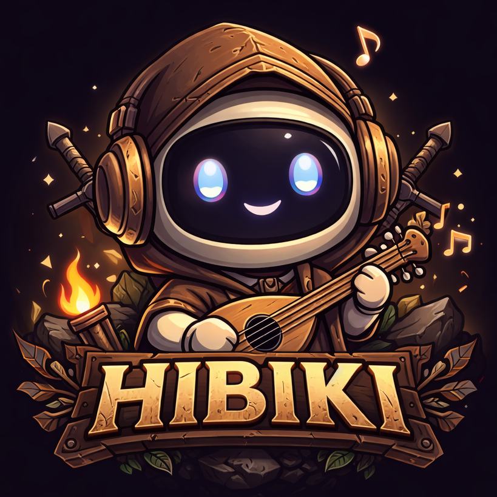

# Hibiki (響)




**Discord audio companion bot** — play music and sound effects in voice channels, controlled from Discord or a web dashboard. Built with **Dungeons & Dragons** in mind (background music, ambience, sound effects at the table) but works for any server.

- **Discord:** `!join`, `!leave`, `!play`, `!effect`, `!volume`, `!menu` (control panel), `!songs` / `!effects`
- **Web dashboard:** Control Center for player state, join/leave, play/effect, **volume (music & effects per server)**, upload and manage sounds, bot status, permissions
- **Single Docker image:** One container, mount `storage/` for persistence (SQLite + uploads)

## Stack

| Part        | Tech                    |
|-------------|-------------------------|
| Bot + API   | NestJS, Discord.js      |
| Dashboard   | Vue 3, TypeScript, Vite |
| Persistence | SQLite (snapshots)      |
| Audio       | discord-player, ffmpeg  |

## Requirements

- **Node.js** 20 or 22 (see [.nvmrc](.nvmrc)). Use `nvm use` or the version in `.nvmrc`; the voice stack uses `@discordjs/opus`, which ships prebuilds only for these versions. Node 23+ can cause "Cannot find module ... opus.node" when joining voice.
- **pnpm** (run `corepack enable` then `pnpm install`)
- **ffmpeg** — required for audio playback. Install via your package manager (`brew install ffmpeg`, `apt install ffmpeg`, etc.)

## Setting up a Discord bot

Before running Hibiki, you need a Discord application and bot token.

### 1. Create an application

1. Open the [Discord Developer Portal](https://discord.com/developers/applications).
2. Click **New Application**, name it (e.g. "Hibiki"), and create it.
3. Open your application. In **General Information**, copy the **Application ID** — this is your `DISCORD_CLIENT_ID`.

### 2. Create the bot and get the token

1. In the left sidebar, go to **Bot**.
2. Click **Add Bot** and confirm.
3. Under **Token**, click **Reset Token** (or **View Token**), then **Copy**. This is your `DISCORD_TOKEN`. Store it securely and never commit it.
4. Under **Privileged Gateway Intents**, enable **Message Content Intent** (required for the bot to read command messages).

### 3. Invite the bot to your server

1. Go to **OAuth2** → **URL Generator**.
2. Under **Scopes**, select **bot**.
3. Under **Bot Permissions**, select at least:
   - **View Channels**, **Send Messages**, **Read Message History**
   - **Connect** (join voice channels) and **Speak** (transmit audio) — required for voice
   - Optionally **Manage Messages** (for the `!delete` command to clear bot messages).
4. Copy the **Generated URL** at the bottom, open it in a browser, choose your server, and authorize.

After the invite, the bot will appear in your server’s member list (offline until Hibiki is running).

### 4. Environment variables

In the repo root, copy the sample env and fill in the values you copied:

```bash
cp .env.sample .env
```

Edit `.env` and set:

- **DISCORD_TOKEN** — the bot token from step 2.
- **DISCORD_CLIENT_ID** — the Application ID from step 1.

Optional: `DISCORD_GUILD_ID` (a server ID for testing), `HIBIKI_PREFIX` (default `!`), and storage paths (defaults are under `storage/`).

## Quick start

```bash
git clone https://github.com/phyberapex/hibiki.git
cd hibiki
corepack enable && pnpm install
cp .env.sample .env   # set DISCORD_TOKEN and DISCORD_CLIENT_ID (see above)
pnpm dev
```

- **Dashboard:** http://localhost:5173 (proxies `/api` to the bot).
- **Bot:** runs on port 3000; the Vue dev server talks to it via proxy.

Open the dashboard, confirm the “Bot connected” indicator, then use the Control Center to join a voice channel and play music or effects. You can also use Discord commands (`!join`, `!play`, etc.) in any server where the bot was invited. **Permissions:** who can use the bot is controlled from the dashboard → Permissions (allowlist of role/user IDs).

### Production build

```bash
pnpm build
pnpm --filter @hibiki/bot start:prod
```

Dashboard is bundled and served by the bot at the same port (e.g. http://localhost:3000).

## Docker

### Run with Compose (local or server)

```bash
cp .env.sample .env   # set DISCORD_TOKEN and DISCORD_CLIENT_ID
mkdir -p storage
docker compose up -d
```

Dashboard + API at http://localhost:3000. Mount `./storage` so uploads and SQLite persist.

### Pre-built images (GitHub Container Registry)

Images are built and pushed via GitHub Actions to **ghcr.io**:

| Tag | When | Use case |
|-----|------|----------|
| `ghcr.io/phyberapex/hibiki:latest` | On each **published release** | Stable; same as the latest version tag. |
| `ghcr.io/phyberapex/hibiki:X.Y.Z` | On each **published release** | Pin to a specific version (e.g. `1.2.0`). |
| `ghcr.io/phyberapex/hibiki:next` | On every **push to main** | Bleeding edge; may be unstable. |
| `ghcr.io/phyberapex/hibiki:<sha>` | On every **push to main** | Pin to a specific commit (e.g. `a1b2c3d`). |

Use version or `latest` for production; use `next` only for testing. See [apps/bot/README.md](apps/bot/README.md) for `docker run` and env vars.

## What the database is for

Hibiki uses **SQLite** (one file, e.g. `storage/data/hibiki.sqlite`) for two things only:

1. **Player snapshots** — Per-guild state (connected channel, current track, idle/playing) is written to the DB so the dashboard can show “last seen” status after a bot restart, even before the bot has reconnected to Discord.
2. **Permissions allowlist** — The list of Discord role IDs and user IDs who are allowed to use the bot (set in the dashboard under Permissions) is stored in the DB and loaded on startup.

Sound files are **not** in the database; they live on disk under `storage/music` and `storage/effects`. The bot discovers them by scanning those folders.

## Crash recovery

If the bot **crashes or restarts** while it was in a voice channel, Discord disconnects it — but the database might still say “joined” until the next write. To avoid showing stale “connected” state on the dashboard:

- When the dashboard (or API) asks for player state, the bot **queries Discord** for its actual voice state in each guild that only has a persisted snapshot (no in-memory manager). If Discord reports that the bot is **not** in a voice channel, the returned state shows **disconnected** and the stale snapshot in the database is **corrected** (upserted as disconnected). If the bot is still in a channel (e.g. it reconnected elsewhere), the channel id and name come from Discord so the UI is accurate.

So the dashboard always reflects the real connection state after a crash or restart; you don’t need to “join again” just to fix the display.

## Docs

- **[apps/bot/README.md](apps/bot/README.md)** — Discord commands, REST API, permissions, persistence, Docker details
- **Docs website** — The [docs/](docs/) folder is a **Jekyll** site: edit [docs/index.md](docs/index.md) (Markdown) and push; GitHub Pages builds it when you use **Settings → Pages** → **Deploy from a branch** → **main** → folder **/docs**. See [docs/README.md](docs/README.md) for how it works and how to add pages.

## Contributing

Contributions are welcome. See **[CONTRIBUTING.md](CONTRIBUTING.md)** for setup, running lint and tests, and how to submit changes.

## About this project

This repository was created largely with the help of **AI-assisted coding tools**. The code and docs are maintained in the same way as any open-source project; we encourage human review, testing, and contributions.

